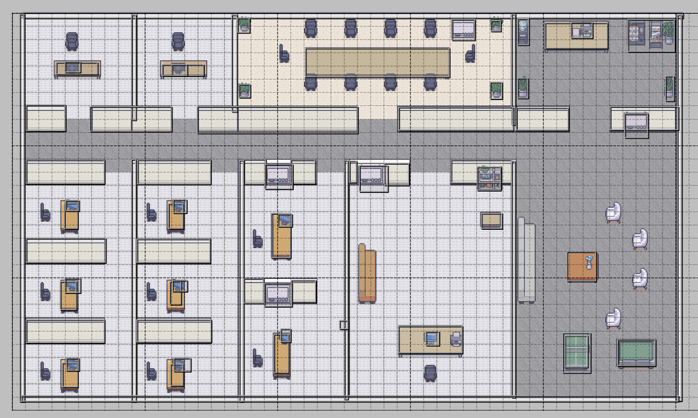
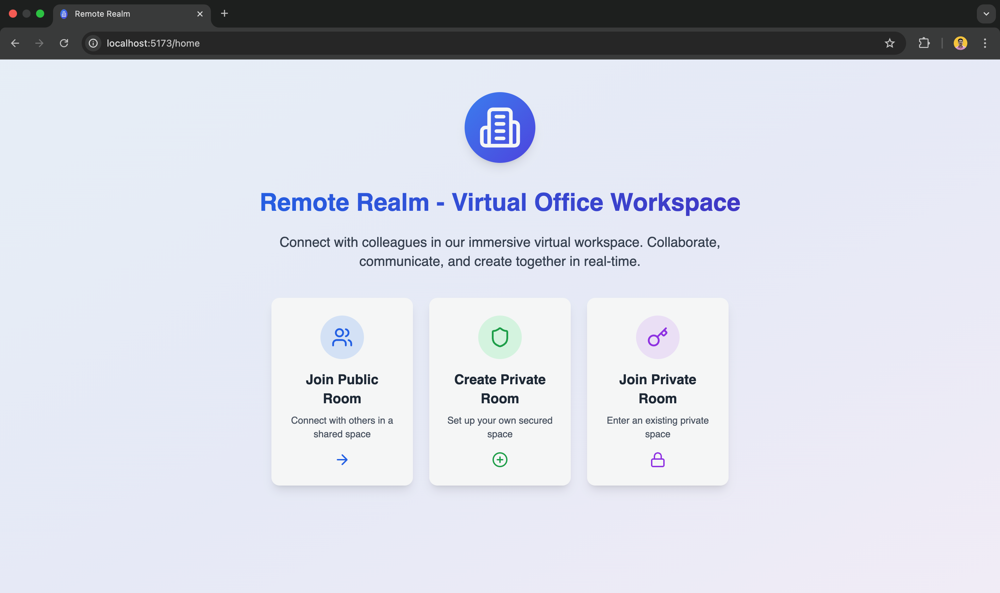
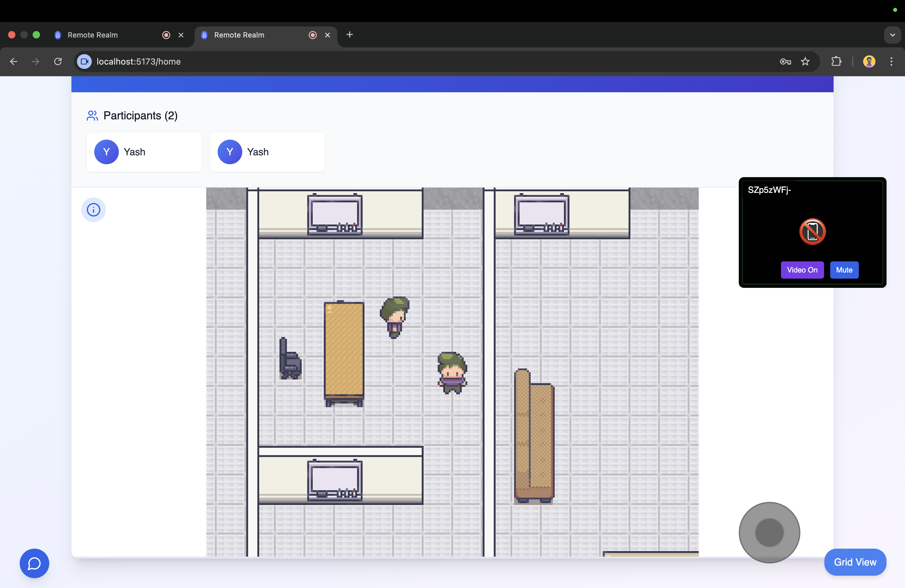
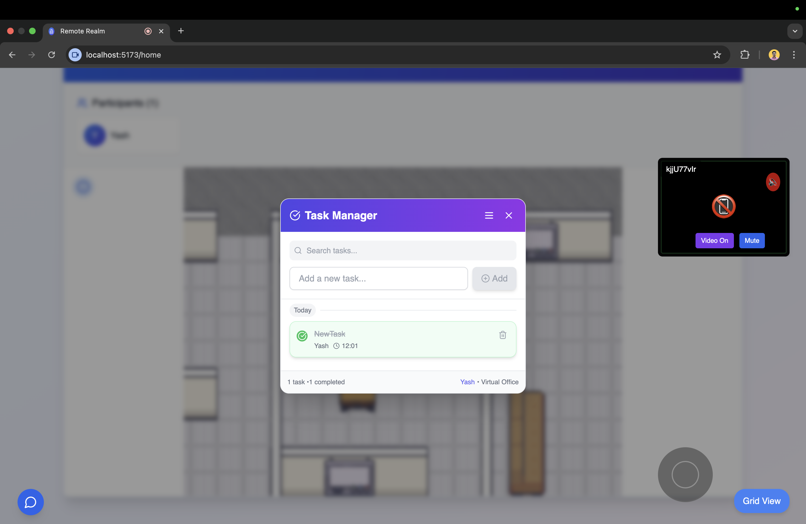
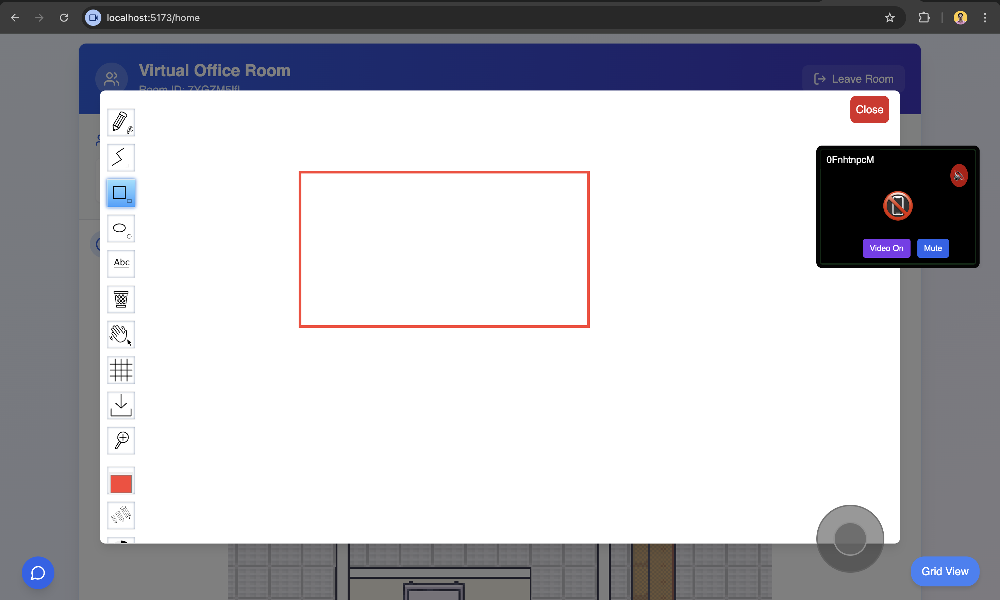
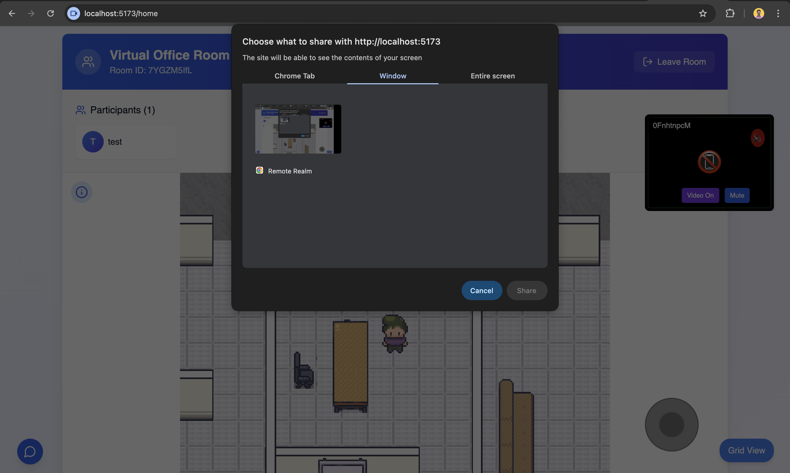
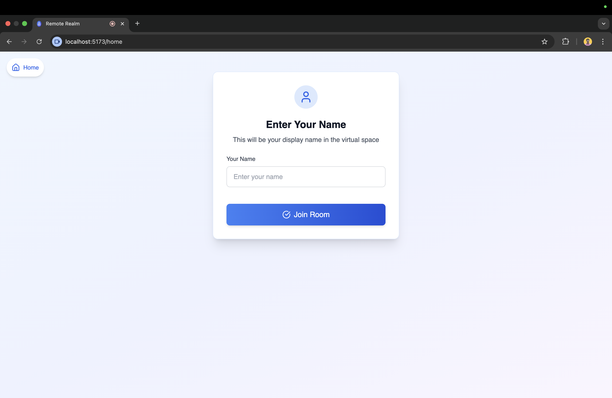
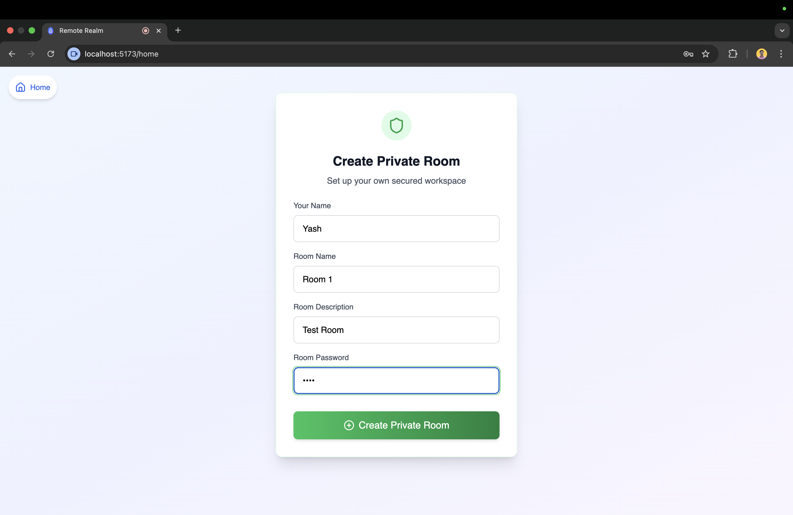
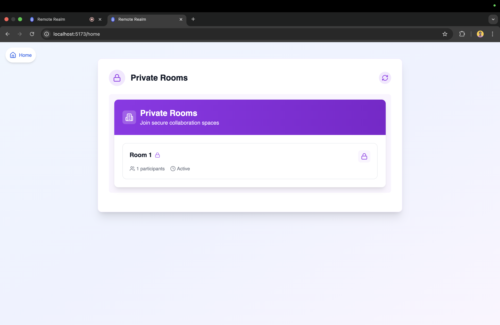

# Remote Realm

**A browser-based 2D metaverse for collaborative remote work**

---

## Table of Contents
1. [Project Overview](#project-overview)
2. [Features](#features)
3. [Technology Stack](#technology-stack)
4. [Architecture](#architecture)
5. [Output Screenshots](#output-screenshots)
6. [Installation & Setup](#installation--setup)
7. [Usage](#usage)
8. [Configuration](#configuration)
9. [Future Work](#future-work)
10. [Contributing](#contributing)
11. [License](#license)

---

## Project Overview
Remote Realm recreates the social and functional dynamics of a physical office in a fully browser-based virtual environment. Users enter public or password-protected private rooms as avatars on a tiled map, move around with keyboard or joystick controls, and see each other’s webcam feeds in real time. Integrated collaborative tools—task management, whiteboard, and screen sharing—are accessible via simple keyboard shortcuts, eliminating context-switching and fostering natural interaction.

## Features
- **Room Management**
  - Join public rooms with just a name.
  - Create and join private rooms (name, title, description, password).
  - Automatic deletion of empty private rooms.
- **Spatial Presence**
  - 2D tile-based office maps created in Tiled and rendered by Phaser.
  - Avatar movement via arrow keys or joystick.
- **Real-Time Media**
  - Peer-to-peer video/audio and screen sharing with PeerJS.
  - Display of each participant’s webcam feed on-screen.
- **Collaborative Tools**
  - **Tasks Pane** (key `T`): full CRUD on tasks with instant notifications.
  - **Whiteboard** (key `W`): shared drawing canvas powered by Whitebophir.
  - **Screen Share** (key `S`): broadcast your screen to all room members.
- **Notifications**
  - Real-time updates for task and whiteboard actions across all clients.

## Technology Stack
- **Backend**: Node.js, Express, Colyseus, Mongoose (MongoDB)
- **Frontend**: React, TypeScript, React Router, React Redux
- **Game Engine**: Phaser for rendering and input
- **Map Editor**: Tiled for custom tilemaps
- **Media**: PeerJS for WebRTC streaming
- **Whiteboard**: Whitebophir

## Architecture
Remote Realm uses a modular, event-driven design:
1. **Room Management**: Colyseus rooms handle player state, task and whiteboard events, and automatic cleanup.
2. **Media Streaming**: PeerJS establishes direct streams for video, audio, and screen share.
3. **Rendering**: Phaser loads Tiled JSON maps and manages avatar sprites and input.
4. **Sync & Persistence**: MongoDB stores room metadata and tasks; Mongoose defines schemas; Express exposes REST endpoints for room lifecycle.
5. **Frontend**: React/TypeScript components subscribe to Colyseus state, render UI panels, and handle user input and API calls.

## Output Screenshots
<div class="screenshot-grid" style="display: grid; grid-template-columns: repeat(auto-fit, minmax(250px, 1fr)); gap: 20px; margin: 20px 0;">
    <div>
        
        <p align="center"><em>Map</em></p>
    </div>    
    <div>
        
        <p align="center"><em>Home Screen</em></p>
    </div>
    <div>
        
        <p align="center"><em>Inside Room</em></p>
    </div>
    <div>
        
        <p align="center"><em>Task Manager</em></p>
    </div>
    <div>
        
        <p align="center"><em>Whiteboard</em></p>
    </div>
    <div>
        
        <p align="center"><em>Screen Share</em></p>
    </div>
    <div>
        
        <p align="center"><em>Public Room Join</em></p>
    </div>
    <div>
        
        <p align="center"><em>Private Room Creation</em></p>
    </div>
    <div>
        
        <p align="center"><em>Available Private Rooms</em></p>
    </div>
    <div>
        
        <p align="center"><em>Private Room Join</em></p>
    </div>
</div>

## Installation & Setup
1. **Clone the repository**
   ```bash
   git clone https://github.com/yourusername/remote-realm.git
   cd remote-realm
   ```

2. Install Dependencies
    ```bash
    npm install && npm run install-all
    ```

3. Environment Variables:
    Create a ```.env``` file in ```/server```
    ```javascript
    PORT=3001
    MONGODB_URI=your_mongo_connection_string
    JWT_SECRET=your_secret_key
    ```

4. Run
    ```bash
    npm run start-all
    ```

5. Access the app: Open ```http://localhost:5173/``` in your browser.


## Usage
1. Home Page: choose “Join Public Room”, “Create Private Room”, or “Join Private Room”.
2. In-Room Controls:
    - Move avatar: arrow keys or joystick.
    - Open tasks pane: press T.
    - Open whiteboard: press W.
    - Start screen share: press S.
3. Tasks Pane: create, edit, delete tasks; updates broadcast to all users.
4. Whiteboard: draw collaboratively; strokes sync in real time.
5. Exit: close the browser tab or press the “Leave Room” button to disconnect.

## Configuration
- Room settings: edit default spawn points and map assets in ```/server/config/rooms.json```.
- Phaser settings: adjust canvas size and physics in ```/client/src/game/config.ts```.
- Whiteboard: customize toolbar options in ```/client/src/components/Whiteboard.tsx```.

## Future Work
- Responsive layouts and mobile support.
- In-app map editor for user-generated environments.
- Avatar customization and proximity-based audio.
- Versioned history for tasks and whiteboard sessions.
- Enhanced scalability with container orchestration.

## Contributing
1. Fork the repo.
2. Create a feature branch (git checkout -b feature/your-feature).
3. Commit your changes (git commit -m "Add your feature").
4. Push to the branch (git push origin feature/your-feature).
5. Open a Pull Request.
---